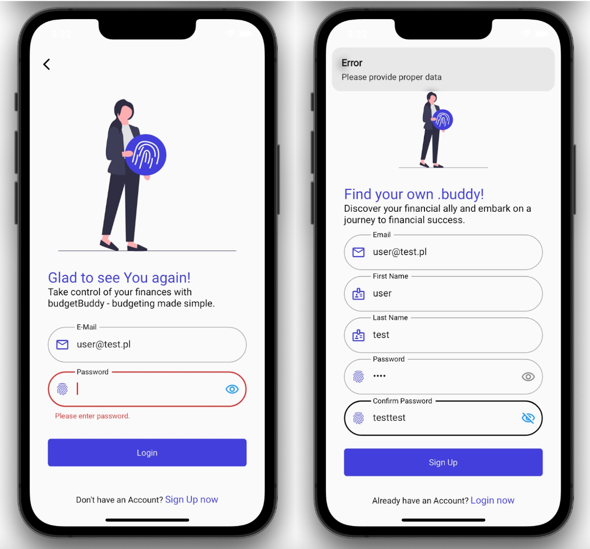
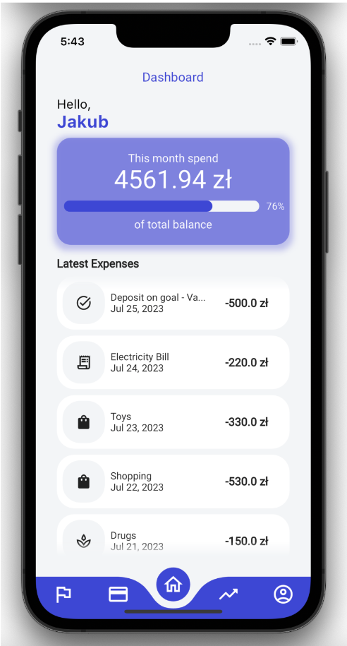
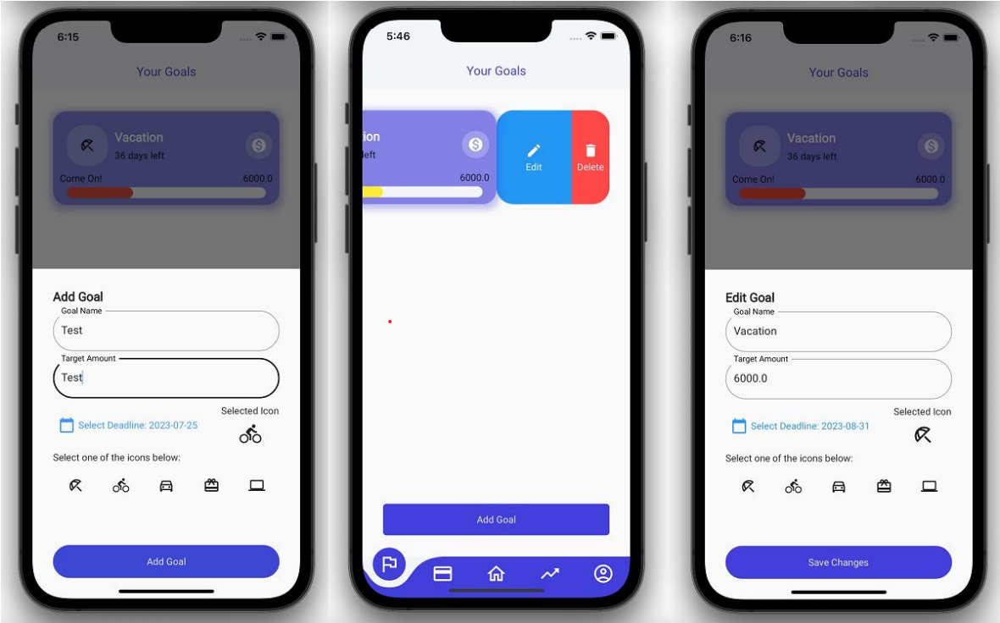
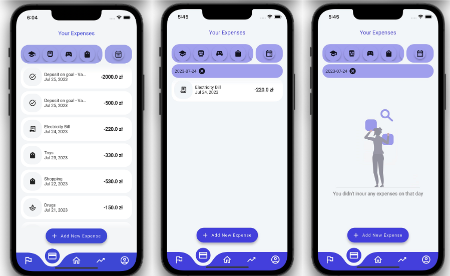
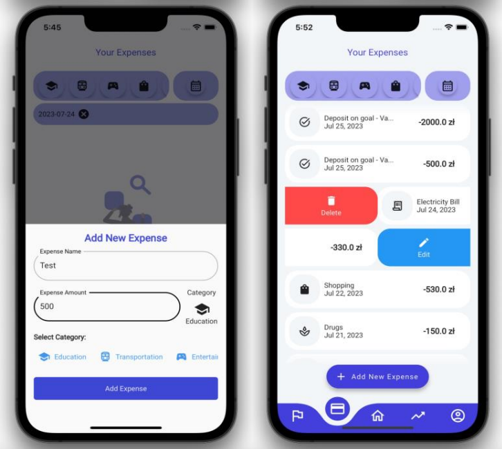
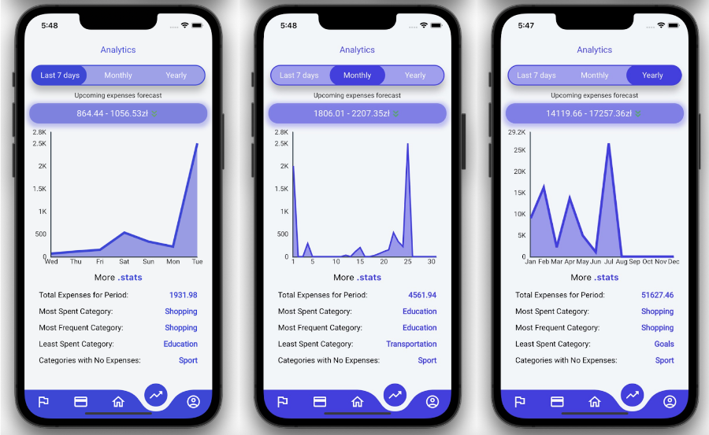
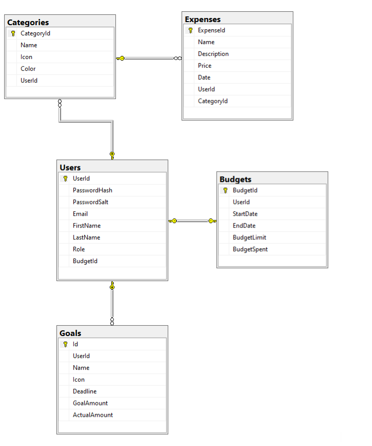

# ProjektZespolowyAPI
ExpenseTracker is a powerful mobile application designed to help users effectively manage their personal budgets. With our app, users can easily track their expenses, set budget limits, and monitor progress towards their financial goals. What sets ExpenseTracker apart from other similar programs is its flexibility, allowing users to create custom expense categories tailored to their individual needs.
https://budgetbuddy2.azurewebsites.net/swagger/index.html

# Tech Stack:
* MSSQL database - Used for storing user data securely.
* .NET web API - Provides the backend logic and handles client requests.
* Azure web hosting - Hosts the web API for accessibility.
* [Flutter App](https://github.com/jtrznadel/budgetBuddy) - The mobile app developed using Flutter.

# Team
* [Marcin Pięta - FoRoko](https://github.com/FoRoKo1o/) - Azure Administrator and Backend Developer.
* [Tomasz Środek - Singulaar](https://github.com/tomaszsrodek99/) - Backend Developer.
* [Patryk Sieniawski - polaster64](https://github.com/polaster64) - Database Administrator adnd Backend Developer.
* [Jakub Trznadel - jtrznadel](https://github.com/jtrznadel/) - Mobile App Developer.

# Preview Images

* Login page
  

    User's data stored in the database is encrypted, and communication with the API is based on JWT tokens.
      
    
  

* Home View
  

    After successful login, users see their last operations and how much of the desired budget was spent.
      
    
  

* Goals View
  

    From this view, users can create goal and check it progress.
      
    
  

  
* Expense View
  

    From this view, users can check all expenses and filter them by date or category.
      
    
  

  
  

    Users can also add new expenses with the adequate button.
      
    
  

* Analytics View
  

    The app automatically generates a report of the user's expenses with forecasted expenses for that period.
      
    
  

## Diagrams
* Use Case Diagram - Briefly explain the key interactions and roles of the actors.
  

    
  

* DataBase diagram
  

    
  

## Summary
In conclusion, ExpenseTracker is a powerful and flexible budget management application that helps users take control of their finances. With features like expense tracking, custom categories, and insightful analytics, it empowers users to achieve their financial goals. We are excited about the progress made so far and look forward to further improvements and community contributions.
